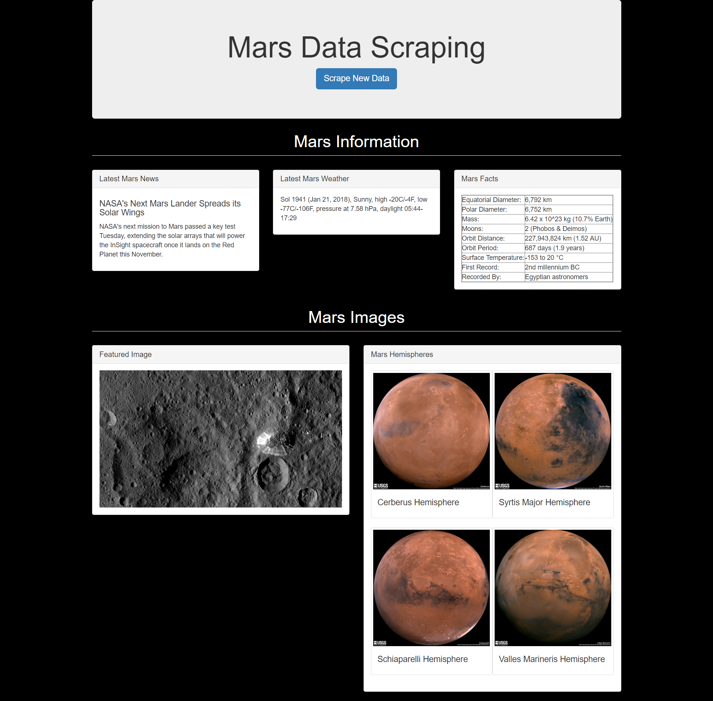

# Mars Data Scraping
A webscraping application which retrieves and presents summary information, the latest news, and images of Mars.

## Data Sources
All data is scraped from the following locations:
* [Nasa Mars News Site](https://mars.nasa.gov/news/)
* [JPL Space Images](https://www.jpl.nasa.gov/spaceimages/?search=&category=Mars)
* [Mars Weather Twitter Account](https://twitter.com/marswxreport?lang=en)
* [Space Facts](http://space-facts.com/mars/)
* [USGS](https://astrogeology.usgs.gov/search/results?q=hemisphere+enhanced&k1=target&v1=Mars)

## Example Output

Scraped data is gathered, stored in a local DB, and presented via a Python Flask application.

